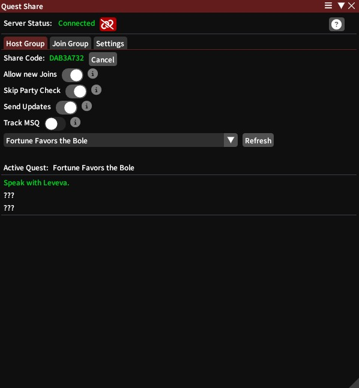
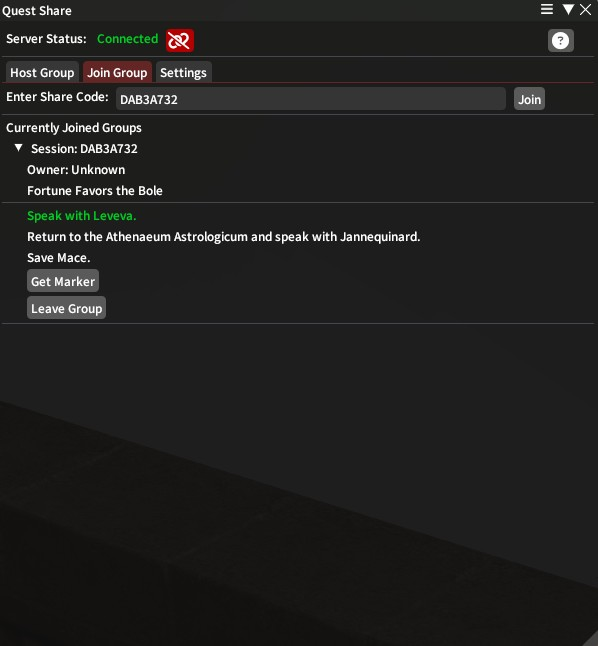

# QuestShare
## Share your quests with your friends so they can join you on your adventures!

### Description

QuestShare is a Dalamud plugin for FFXIV that allows you to share your quest progress with friends so they can join you on your adventures. It keeps track of the current step of a quest and gives options to flag the destination of each step. No more needing to manually flag locations for your ride. ;)

### Installation

The plugin is installed through Dalamud's Plugin Installer. **This plugin is currently testing exclusive, so you will have to enable experimental builds in Dalamud to see it**.

### Usage

The plugin consists of two main parts, the "Host Group" tab and "Join Group" tab.

#### Host Group

In this screen, you create a code that you share with friends, then they can join you. A number of options are available, each with hover text to explain what they do:

- **Allow New Joins**: Allows new people to join your group. If disabled, only people who have joined before can see your progress.
- **Skip Party Check**: By default, users must be in your party in order to join the group. Enabling this will allow anyone to join that has the share code.
- **Send Updates**: By default, the plugin will send updates to the group every time you change steps. Disabling this will prevent updates from being sent.
- **Track MSQ**: When enabled, the plugin will automatically share MSQ progress and progress along the quest chain.

Below this is the quest selection, and a display of the current quest steps. By default, future steps are displayed as "???" to avoid spoilers (configurable).

#### Join Group

In this screen, you enter the code that your friend has shared with you. You will see their progress and the options they have selected. You can also see the current step of the quest and flag the destination. You can join multiple groups at once, and the plugin will keep track of all of them.

The "owner" of the group is stored client-side and will only be known if you are joined to the host's party. No identifiable information is shared with the server.

Click "Get Marker" to automatically flag the destination on your map. Some quests may not work with this feature (such as instances).

### Future Plans

- Teleporting to the nearest aetheryte to the destination
- Sharing the current location of the host
- Listing current members of the group

### Self-Hosting

The [server component](https://github.com/Era-FFXIV/QuestShare.Server) can be used to host your own server, if you wish. It runs in a Docker container for ease of use. Limited support is available for this, though.
